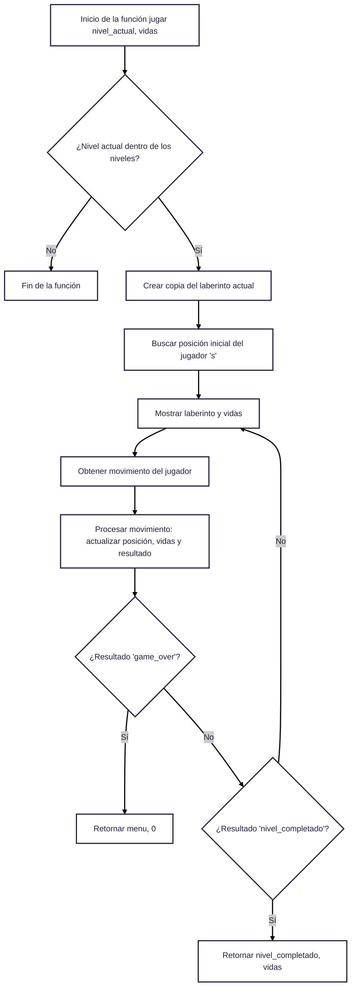
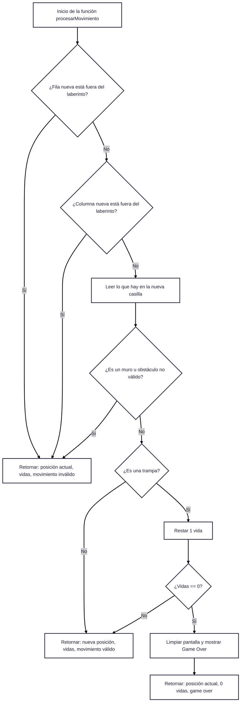
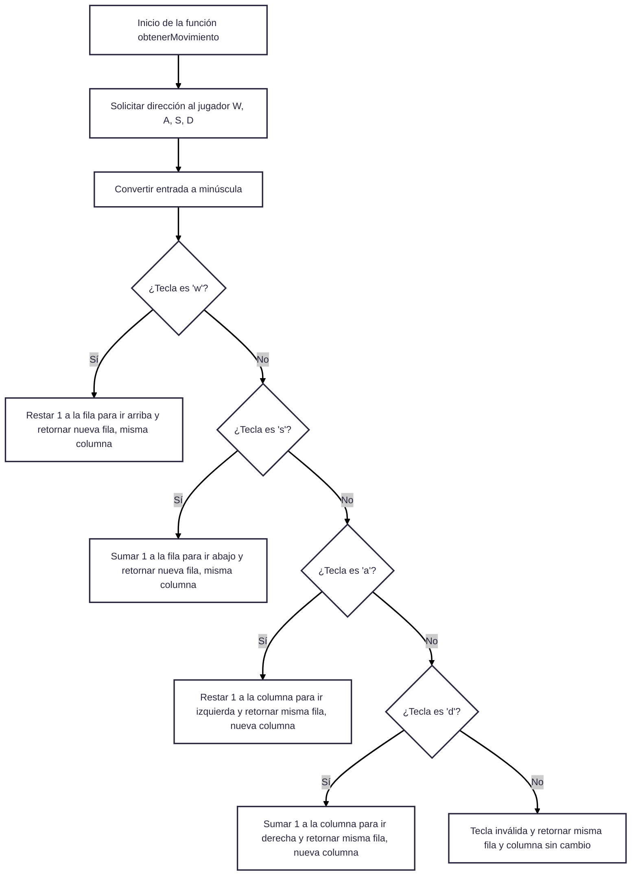

# 🧩 PYXELOST: Juego de Laberinto en Consola (Pyxel)

 PYXELOST es un pequeño juego de laberinto que se ejecuta en la consola de Python, donde el objetivo del jugador es atravesar un laberinto plagado de trampas y encontrar la meta .El juego incluye múltiples niveles, sistema de vidas, temporizador y 3 tipos de trampas.
 

#  Objetivos.

## Objetivo General
Desarrollar un videojuego de tipo laberinto en Python llamado PYXELOST", que se ejecute en la consola estándar y este compuesto por 10 niveles progresivos representados por matrices, que además permita al jugador desplazarse, esquivar trampas y alcanzar la meta, fortaleciendo habilidades de lógica, programación estructurada y control de flujo.
________________________________________
## Objetivos Específicos
1.	Diseñar laberintos mediante matrices de Python, empleando distintos símbolos visuales para representar paredes, espacios libres, trampas, jugador y meta.
2.	Implementar un sistema de movimiento con las teclas WASD, que permita al jugador desplazarse arriba, abajo, izquierda o derecha dentro del laberinto.
3.	Controlar el progreso del jugador, permitiendo avanzar de nivel al alcanzar la meta y finalizar el juego al completar todos los niveles.
4.	Incorporar una mecánica de vidas, donde el jugador pierde al caer en trampas y el juego termina cuando se terminen todas.
5.	Construir una interfaz textual intuitiva, que incluya pantalla de título, menú principal, selección de niveles, y mensajes de felicitación o derrota.
6.	Permitir la selección individual de niveles, además del modo progresivo desde el nivel 1.
7.	Mostrar visualmente los elementos del juego, garantizando que cada nivel se vea claro y balanceado en la consola.

## Lógica General del Juego PYXELOST

PYXELOST es un juego de laberinto programado en Python que se desarrolla en una interfaz de texto (consola). El juego se basa en recorrer laberintos representados por matrices, con el objetivo de llegar a la meta evitando trampas, con un número limitado de vidas.

### Ciclo de ejecución principal
1. Pantalla de título y bienvenida:
*  Se muestra un título animado y se pide al jugador que presione una tecla para continuar.
2.	Menú principal:
	El jugador puede:
*	Comenzar desde el nivel 1.
*	Seleccionar un nivel específico.
*	Salir del juego.
3.	Inicio del juego:
*	Se carga el nivel actual desde una lista de matrices (niveles).
*	Se busca la posición inicial del jugador, simbolizado con (🤖) dentro del laberinto.

### Mecánica del juego por nivel
1.	Visualización:
El laberinto se imprime en pantalla usando emojis para representar cada elemento:
*	🔲 = pared
*	🤖 = jugador
*	🏁 = meta
*	👺 / 👽 = trampas
*	= espacio libre
o	Se muestran las vidas actuales del jugador con corazones.
2.	Movimiento:
El jugador se mueve con las teclas:
*	W = arriba
*	A = izquierda
*	S = abajo
*	D = derecha
*	Solo puede moverse si no hay una pared en la dirección elegida.
3.	Interacción con el entorno:
*	Si pisa un espacio libre, se mueve sin consecuencias.
*	Si pisa una trampa (👺), pierde una vida.
*	Si las vidas llegan a 0, el juego termina con un mensaje de "Game Over".
*	Si llega a la meta (🏁), se avanza al siguiente nivel.

 Progreso y finalización
*	El juego avanza automáticamente al completar cada nivel.
*	Si el jugador completa los 10 niveles, se muestra una pantalla de felicitaciones.
*	Después de ganar, puede volver al menú principal o salir.
*	Si pierde todas sus vidas, se reinicia desde el menú.

Aspectos clave de la lógica
* 	Matrices como base del entorno: Cada laberinto es una lista de listas que representa visual y lógicamente el espacio del jugador.
*	Búsqueda de posición inicial del jugador: Se realiza al cargar el nivel.
*	Validación de movimientos: Se controla que el movimiento sea dentro de los límites del laberinto y que no choque contra las paredes.
*	Sistema de vidas: Controla la dificultad y penaliza al jugador por errores.
*	Flujo condicional y bucles: El juego utiliza while y if para manejar la lógica de ciclos y eventos.

## Diagramos de flujo.
**flujo de la funcion jugar**

**Flujo de la funcion procesar movimiento**

**Obtener movimiento**

**Flujo principal del juego**

## INTEGRANTES
- [Juan Carlos Polania Bolivar](https://github.com/Ciyuang)
- [Erick Llanos Espinel](https://github.com/erickllanos120)
- [fabian Camilo Linares Villalba](https://github.com/campersi93)
